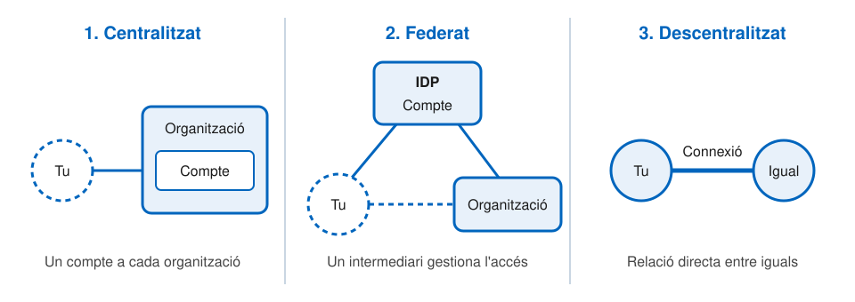
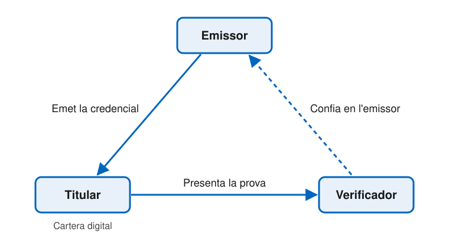
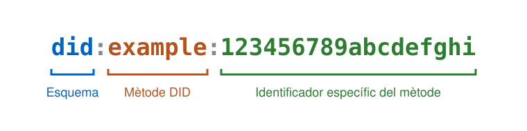
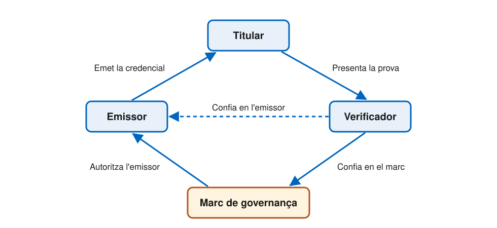

# Introducció a la identitat digital sobirana (SSI)

---

## Què és la identitat digital sobirana?

- **_Self-Sovereign Identity_ (SSI)**: nou model d'identitat digital a Internet
- **Identitat digital**: com demostram qui som als llocs web, serveis i aplicacions amb els quals volem establir una relació de confiança
- És un **canvi de paradigma**, no només tecnològic:
  - Canvia la infraestructura d'Internet
  - Canvia qui té el **control** de la identitat i de les dades

---

## Internet no té capa d'identitat

> _The Internet was built without an identity layer._
>
> — Kim Cameron, arquitecte en cap d'identitat de Microsoft, _The Laws of Identity_ (2005)

- Internet es va dissenyar per interconnectar **màquines**, no persones
- Amb TCP/IP només coneixem l'**adreça de la màquina** a la qual ens connectam
- No sabem res de la **persona, organització o cosa** que hi ha al darrere

---v

## Per què és tan difícil de resoldre?

- La Internet original era petita: un club d'acadèmics que es coneixien entre ells
- Avui hi ha milers de milions de persones i dispositius, i gairebé tots són **desconeguts**
- Molts volen **enganyar-nos** sobre qui són o amb qui estam tractant
- La identitat (o la seva absència) és una de les principals fonts de **cibercrim**

---

## Com de greu és el problema?

- Un usuari d'empresa gestionava de mitjana **191 contrasenyes** (2017)
- El **80%** de les bretxes per _hacking_ es deuen a contrasenyes compromeses
- **3.000 milions** de comptes de Yahoo compromesos en una sola bretxa
- La bretxa d'Equifax ha costat a l'empresa més de **4.000 milions de dòlars**
- Més del **90%** dels consumidors nord-americans creuen que han perdut el control de les seves dades personals

---v

> Si no feim res, ens enfrontarem a una proliferació d'episodis de robatori i engany que erosionaran la confiança pública en Internet.
>
> — Kim Cameron (2005)

---

## Blockchain i descentralització

- **2008**: Satoshi Nakamoto publica _Bitcoin: A Peer-to-Peer Electronic Cash System_
- **2015**: la comunitat d'identitat (_Internet Identity Workshop_) comença a estudiar la «identitat blockchain»
- Governs dels EUA, la Unió Europea, Xina i Corea exploren la identitat digital descentralitzada
- Objectiu comú: passar de sistemes d'identitat **centralitzats** a sistemes **descentralitzats**

---

## Els tres models d'identitat digital

---

## 1. Model centralitzat

- És el model de gairebé tots els identificadors i credencials: DNI, passaport, carnet de conduir, comptes d'usuari...
- A Internet: ens registram i obtenim un **compte** (usuari i contrasenya) a cada lloc web
  - Per això també s'anomena **identitat basada en comptes**
- Les credencials **pertanyen a l'organització**, no a nosaltres
  - Si esborram el compte, desapareixem; les dades, en canvi, les conserva l'organització

---v

## Problemes del model centralitzat

- La càrrega de recordar i gestionar totes les contrasenyes recau en **l'usuari**
- Cada lloc aplica les seves pròpies polítiques de seguretat i privadesa
- Les dades d'identitat **no són portables** ni reutilitzables
- Les bases de dades centralitzades són **_honeypots_** gegants: origen d'algunes de les majors bretxes de dades de la història

---

## 2. Model federat

- S'afegeix un intermediari: el **proveïdor d'identitat** (_Identity Provider_, IDP)
- Un sol compte a l'IDP ens permet iniciar sessió a tots els llocs que hi confien
  - Cada un d'aquests llocs és una **part usuària** (_Relying Party_, RP)
  - El conjunt de llocs que usen el mateix IDP és una **federació**
- Protocols: **SAML**, **OAuth** i **OpenID Connect**
- Exemples: _single sign-on_ (SSO) corporatiu, «Inicia sessió amb Google / Facebook / GitHub»

---v

## Problemes del model federat

- No hi ha un IDP que funcioni a tot arreu: acabam tenint comptes a diversos IDP
- L'IDP és un **intermediari** que pot vigilar la nostra activitat a tots els llocs
- Els grans IDP són dels majors _honeypots_ per al cibercrim
- Els comptes tampoc no són portables: si deixam l'IDP, perdem tots els accessos
- No serveixen per compartir les dades més valuoses: passaport, dades de salut, dades financeres...

---

## 3. Model descentralitzat

- Sorgeix el 2015, inspirat en la tecnologia blockchain
- **Ja no es basa en comptes**: funciona com la identitat al món real
- Relació directa entre **iguals** (_peer-to-peer_)
  - Cap de les dues parts «proveeix», «controla» ni «posseeix» la relació
  - No hi ha un compte, sinó una **connexió** compartida
- Vàlid per a persones, organitzacions i coses

---v

## El paper de la criptografia

- La base és la **criptografia de clau pública**
- La blockchain no s'usa com a moneda, sinó com a **infraestructura de clau pública descentralitzada** (DPKI):
  - **Intercanviar claus públiques** directament, per crear connexions privades i segures entre dos iguals
  - **Publicar algunes claus públiques** per poder verificar les signatures de les **credencials verificables**

---v

## L'analogia de la cartera

- Demostram la identitat cada dia de la mateixa manera: treim la cartera i ensenyam credencials que ens ha emès algú de confiança
- El model descentralitzat fa el mateix amb:
  - **Carteres** digitals
  - **Credencials** digitals
  - **Connexions** digitals

---

## Comparació dels tres models

| | Centralitzat | Federat | Descentralitzat |
| --- | --- | --- | --- |
| **Base** | Compte a cada lloc | Compte a un IDP | Connexió entre iguals |
| **Qui controla** | L'organització | L'IDP | L'usuari |
| **Portabilitat** | No | No | Sí |
| **Intermediari** | No | Sí | No |

---

## Per què «sobirana»?

- **Sobirà**: autònom, independent; que no depèn de cap altre poder
- **Identitat sobirana**: la identitat d'una persona que no depèn de cap altre poder ni hi està sotmesa
- El terme és potent, però també polèmic: ha alimentat dos mites

---v

## Dos mites sobre la SSI

1. **«És identitat autoafirmada»**: fals
   - La major part de la informació sobre la nostra identitat prové de **fonts de confiança**, igual que les credencials de la cartera física
   - La identitat emesa pels governs **no competeix** amb la SSI: són complementàries
2. **«És només per a persones»**: fals
   - S'aplica igualment a organitzacions i coses: a **qualsevol entitat** que necessiti identitat a Internet

---

## Per què és important?

- La SSI representa un **canvi de control**:
  - Dels **centres de la xarxa** (emissors i verificadors)
  - A les **vores de la xarxa** (els usuaris, que interactuen com a iguals)
- Per això va més enllà de la tecnologia: té dimensions **empresarials, legals i socials**
- El repte: que les diferents arquitectures SSI siguin **interoperables**, igual que Internet va fer interoperables les xarxes locals

---

## Què impulsa l'adopció?

1. **Eficiència empresarial i experiència d'usuari**
   - Seguretat, reducció de costos, compliment normatiu i comoditat
   - És el principal motor en l'etapa inicial
2. **Resistència a l'economia de la vigilància**
   - Reacció al model de negoci basat en les dades personals
   - Governs com la Unió Europea, amb el RGPD, lideren aquest moviment
3. **Moviment de l'individu sobirà**
   - Fer per a la identitat el que Bitcoin vol fer per als diners

---v

## Exemples per sectors

- **Comerç electrònic**: registre i accés sense contrasenyes, avís si el lloc no pot acreditar qui és
- **Banca i finances**: credencials per superar controls KYC i AML sense reomplir formularis
- **Salut**: historial clínic a la cartera del pacient, consentiment verificable
- **Viatges**: prova instantània de credencials amb un codi QR, revelant només les dades necessàries

---

## Els set blocs bàsics de la SSI

1. Credencials verificables
2. El triangle de confiança: emissors, titulars i verificadors
3. Carteres digitals
4. Agents digitals
5. Identificadors descentralitzats (DID)
6. Blockchains i altres registres de dades verificables
7. Marcs de governança

---

## 1. Credencials verificables

- **Credencial**: conjunt d'informació que una autoritat afirma que és certa sobre un subjecte
  - Certificat de naixement, títol universitari, passaport, carnet de conduir...
- Conté **afirmacions** (_claims_) sobre el subjecte:
  - **Atributs**: edat, alçada...
  - **Relacions**: progenitor, empleat, ciutadà...
  - **Drets**: prestacions mèdiques, permisos...
- No es limiten a persones: també poden descriure animals, productes o dispositius IoT

---v

## Què vol dir «verificable»?

Un verificador ha de poder determinar:

- **Qui** ha emès la credencial
- Que **no ha estat alterada** des que es va emetre
- Que **no ha caducat ni ha estat revocada**
- Si escau, que qui la presenta n'és realment el **subjecte**

Amb criptografia i un protocol estàndard, la verificació és digital i es fa en **segons o mil·lisegons**.

---v

## Estructura d'una credencial verificable

Segons el model de dades de credencials verificables del W3C:

1. **Identificador** únic de la credencial
2. **Metadades**: per exemple, la data de caducitat
3. **Afirmacions**: nom, data de naixement...
4. **Signatura digital** de l'emissor

---

## 2. Emissors, titulars i verificadors

- **Emissor** (_issuer_): origen de la credencial
  - Governs, bancs, universitats, empreses... però també persones o coses
- **Titular** (_holder_): demana credencials, les guarda a la cartera i en presenta **proves** quan un verificador ho sol·licita
  - Sempre té l'opció de **no** presentar-les
- **Verificador** (_verifier_): demana proves d'una o més afirmacions i comprova la signatura de l'emissor

---v

## El triangle de confiança

---v

- Les credencials només transmeten confiança si **el verificador confia en l'emissor**
  - No cal que hi tengui una relació directa, comercial ni legal
- El triangle descriu només **una banda** de la transacció
  - En una mateixa transacció, les dues parts poden fer de titular i de verificador
  - Moltes transaccions acaben amb l'emissió d'una **credencial nova**

---

## 3. Carteres digitals

- Fan la mateixa feina que una cartera física:
  - Guardar les credencials en un sol lloc
  - Protegir-les de robatoris i mirades alienes
  - Tenir-les sempre a mà, a tots els dispositius
- Una cartera SSI hauria de:
  - Implementar **estàndards oberts** i acceptar qualsevol credencial estandarditzada
  - Poder-se instal·lar a qualsevol dispositiu
  - Permetre **còpia de seguretat** i **migració** a carteres d'altres proveïdors
  - Oferir la **mateixa experiència** amb independència del proveïdor

---

## 4. Agents digitals

- Programari que **opera la cartera** en nom del seu propietari
  - Garanteix que només el propietari pot usar les credencials i les claus
- Els agents parlen entre ells per **crear connexions** i **intercanviar credencials**
  - Mitjançant un protocol de missatgeria segur i descentralitzat (DIDComm)
- Dos tipus segons on s'executen:
  - **Agents de vora** (_edge agents_): als dispositius del titular
  - **Agents al núvol** (_cloud agents_): allotjats per un proveïdor

---

## 5. Identificadors descentralitzats (DID)

- Per verificar una signatura cal conèixer la **clau pública correcta** del signant
- La solució tradicional és la **PKI**, amb autoritats de certificació: massa centralitzada i costosa per a una infraestructura on cada participant gestiona moltes claus
- Un **DID** és un nou tipus d'identificador amb quatre propietats:
  - **Permanent**: no canvia mai
  - **Resoluble**: permet obtenir les claus públiques i l'adreça de l'agent
  - **Verificable criptogràficament**: el titular pot demostrar que controla la clau privada
  - **Descentralitzat**: sense autoritat central de registre

---v

## Anatomia d'un DID

- El DID fa d'**adreça** d'una clau pública en una xarxa descentralitzada

---v

## Mètodes DID

- Cada **mètode DID** defineix com operar sobre una xarxa concreta:
  - **Crear** el DID i el seu **document DID** (claus públiques i metadades)
  - **Llegir** el document DID
  - **Actualitzar-lo**, per exemple per rotar una clau
  - **Desactivar** el DID
- Alguns mètodes no necessiten cap registre distribuït: funcionen només entre iguals (per exemple, `did:peer`)

---v

## Connexions DID a DID

- **Permanents**: només es trenquen si una de les parts ho vol
- **Privades**: comunicació xifrada i signada
- **D'extrem a extrem**: sense intermediaris
- **De confiança**: permeten intercanviar credencials verificables
- **Extensibles**: serveixen per a qualsevol aplicació que necessiti comunicació segura

---

## 6. Blockchains i registres de dades verificables

- **Blockchain**: base de dades distribuïda, resistent a manipulacions, que **cap part controla**
- Resol un sol problema: dades fiables **sense autoritat central**
- Triple ús de la criptografia:
  1. Transaccions **signades digitalment**
  2. Blocs **encadenats per _hash_**
  3. Blocs **replicats** a tots els nodes per consens
- Per a la SSI: font de veritat per a DID i claus públiques

---

## 7. Marcs de governança

- La confiança criptogràfica no és **confiança humana**
- Confiar en cada emissor d'un en un no escala
  - Com les targetes de crèdit abans de Visa i MasterCard
- **Marc de governança** (_trust framework_): regles de negoci, legals i tècniques
  - L'administra una **autoritat de governança**
  - Diu quins emissors estan autoritzats
- El verificador pot acceptar un emissor que no coneix, si l'autoritza un marc en què confia

---v

## El segon triangle de confiança

---

## Resum dels blocs

| Bloc | Funció |
| --- | --- |
| **Credencials verificables** | Equivalent digital de les credencials físiques |
| **Emissor, titular, verificador** | Els tres rols del triangle de confiança |
| **Carteres digitals** | Guarden les credencials al dispositiu |
| **Agents digitals** | Operen la cartera i es comuniquen amb altres agents |
| **DID** | Adreces digitals sense autoritat central de registre |
| **Registres de dades verificables** | Font de veritat per a DID i claus públiques |
| **Marcs de governança** | Regles que fan interoperables els ecosistemes de confiança |

---

## Reptes per a l'adopció

1. **Construir l'ecosistema**
   - Els efectes de xarxa només arriben quan sectors i governs accepten les credencials dels altres
   - Requereix interoperabilitat real entre carteres i credencials
2. **Gestió descentralitzada de claus**
   - Perdre les claus privades equival a perdre la identitat digital
   - Històricament, el taló d'Aquil·les de la criptografia
3. **Accés sense connexió**
   - Cal poder demostrar la identitat sense accés a Internet

---

## Referències

- A. Preukschat i D. Reed, _Self-Sovereign Identity: Decentralized digital identity and verifiable credentials_, Manning, 2021 (capítols 1 i 2)
- K. Cameron, [_The Laws of Identity_](https://www.identityblog.com/?p=352), 2005
- W3C, [_Verifiable Credentials Data Model_](https://www.w3.org/TR/vc-data-model/)
- W3C, [_Decentralized Identifiers (DIDs)_](https://www.w3.org/TR/did-core/)
