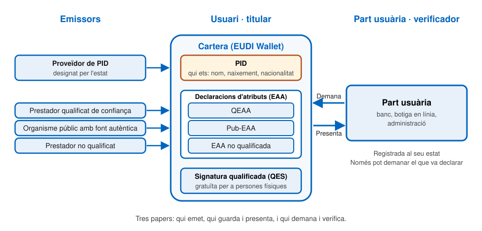
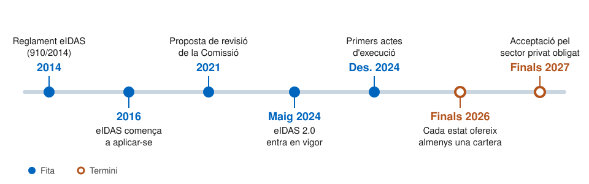

# D'eIDAS a eIDAS 2.0

---

## eIDAS: el punt de partida

- **Reglament (UE) 910/2014**, relatiu a la identificació electrònica i els serveis de confiança
- Aplicable des de l'**1 de juliol de 2016**
  - Deroga la Directiva 1999/93/CE de signatura electrònica
- Com a reglament, és **directament aplicable** a tots els estats membres
- Té dos pilars:
  1. **Identificació electrònica**
  2. **Serveis de confiança**

---v

## Pilar 1: identificació electrònica

- Cada estat membre té el seu propi sistema d'identificació electrònica, com el DNI electrònic a Espanya
- L'estat pot **notificar-lo**: comunicar-lo formalment a la Comissió perquè els altres estats l'avaluïn i el reconeguin
  - És voluntari: cada estat decideix si ho fa
- **Reconeixement mutu**: un cop notificat, els serveis públics dels altres estats l'han d'acceptar

---v

## Pilar 2: serveis de confiança

- Serveis regulats:
  - **Signatura electrònica** (persones físiques) i **segell electrònic** (persones jurídiques)
  - **Segell de temps** electrònic
  - **Entrega electrònica certificada**
  - **Certificats d'autenticació de llocs web**
- Distingeix entre serveis **qualificats** i no qualificats
  - Els prestadors qualificats estan supervisats i figuren a les **llistes de confiança**
- La **signatura electrònica qualificada** (QES, _Qualified Electronic Signature_) té el mateix efecte jurídic que la signatura manuscrita, i es reconeix a tots els estats membres

---

## Per què calia revisar-lo?

- **Fragmentació**: solucions nacionals divergents i estats sense cap mitjà d'identificació electrònica
- **Sector privat**: els beneficis d'eIDAS no hi arribaven
- **Només identitat**: no preveia compartir atributs verificats, com títols acadèmics o qualificacions professionals
- **Control de l'usuari**: calia que cada persona pogués decidir quines dades comparteix i amb qui

> Objectiu per al 2030: una identitat digital de confiança, voluntària i controlada per l'usuari, reconeguda a tota la Unió.

---

## eIDAS 2.0

- **Reglament (UE) 2024/1183**, d'11 d'abril de 2024
- No substitueix eIDAS: **modifica** el Reglament 910/2014
- En vigor des del **20 de maig de 2024**
- Estableix el **marc europeu d'identitat digital**
- Tres grans novetats:
  1. La **cartera europea d'identitat digital**
  2. Les **declaracions electròniques d'atributs** (EAA)
  3. **Nous serveis de confiança**

---

## La cartera europea d'identitat digital

- _European Digital Identity Wallet_ (EUDI Wallet)
- És un **mitjà d'identificació electrònica** que permet a l'usuari:
  - Guardar i gestionar les seves **dades d'identificació** (PID) i les seves **declaracions d'atributs** (EAA)
  - Presentar-les a les parts usuàries (_relying parties_) i a altres carteres
  - **Signar** amb signatura electrònica qualificada (QES)
- Cada estat membre n'ha d'oferir **almenys una**, amb nivell de garantia **alt**: identitat verificada a fons i claus en maquinari segur

---v

## Nivells de garantia

- El **nivell de garantia** diu quanta confiança es pot tenir que l'usuari és qui diu ser
- Depèn de dues coses:
  - Com es va **comprovar la identitat** en donar-lo d'alta
  - Com de difícil és **suplantar-lo** després
- Tres nivells:
  - **Baix**: només redueix el risc de suplantació
  - **Substancial**: el redueix força; per exemple, dos factors i identitat contrastada
  - **Alt**: l'ha d'evitar; identitat verificada presencialment o equivalent, i claus en maquinari segur
- La cartera europea ha de ser de nivell **alt**

---v

## Qui proporciona la cartera?

- Tres vies possibles:
  - Directament l'**estat membre**
  - Un tercer, per **mandat** de l'estat
  - Un tercer **independent**, però reconegut per l'estat
- El codi font dels components d'aplicació ha de tenir **llicència de codi obert**

---v

## Què ha de permetre fer

- Obtenir, guardar, combinar i presentar dades d'identificació i atributs, **en línia i fora de línia**
- **Divulgació selectiva**: compartir només les dades necessàries
- Generar **pseudònims**
- Intercanviar dades de forma segura **entre dues carteres**
- Consultar un **registre de transaccions**, demanar la supressió de dades i denunciar peticions sospitoses
- **Signar** amb signatura electrònica qualificada
- Exercir el dret a la **portabilitat** de les dades

---v

## Garanties per a l'usuari

- **Voluntària**: no es pot perjudicar qui no la faci servir
- **Gratuïta** per a les persones físiques
  - També la signatura qualificada, per a usos no professionals
- **Control total** de l'usuari sobre les seves dades
- **Sense seguiment**: ni el proveïdor de la cartera ni els emissors poden rastrejar l'ús que se'n fa
- **Accessible** per a persones amb discapacitat

---

## Dades d'identificació de la persona (PID)

- **PID** (_Person Identification Data_): el conjunt de dades que identifica una persona: nom, cognoms, data de naixement, nacionalitat...
- Les emet un **proveïdor de PID** designat per cada estat, d'acord amb la seva llei
- És l'equivalent del DNI dins la cartera: sense un PID vàlid, la cartera no pot identificar l'usuari

---

## Declaracions electròniques d'atributs (EAA)

- **Atribut**: característica, qualitat, dret o permís d'una persona o d'un objecte
- **Declaració electrònica d'atributs** (_Electronic Attestation of Attributes_, EAA): declaració en format electrònic que permet autenticar atributs
- Tres tipus, segons qui les emet:
  - **EAA, no qualificada**: qualsevol prestador de serveis de confiança
  - **QEAA** (_Qualified EAA_): un prestador **qualificat** de serveis de confiança
  - **Pub-EAA** (_Public body EAA_): un organisme públic responsable d'una **font autèntica**, o algú en nom seu

---v

## PID i EAA

- El PID diu **qui ets**; una declaració d'atributs diu **què és cert sobre tu**: un títol, un permís, una adreça
- Legalment són categories diferents: el reglament tracta el PID a part de les EAA
- Tècnicament es construeixen igual, amb els mateixos formats i protocols
- Les dues viuen a la cartera i es presenten de la mateixa manera

---v

## Efecte jurídic

- Cap declaració d'atributs es pot rebutjar només pel fet de ser electrònica
- Les **QEAA** i les **Pub-EAA** tenen el mateix efecte jurídic que les declaracions en paper
- Les **Pub-EAA** d'un estat membre es reconeixen a tots els altres

---v

## Atributs mínims verificables

Els estats han de permetre verificar, contra fonts autèntiques del sector públic, almenys:

- Adreça, edat, gènere, estat civil i composició familiar
- Nacionalitat o ciutadania
- Títols acadèmics i qualificacions professionals
- Poders de representació
- Permisos i llicències públics
- Dades financeres i societàries (persones jurídiques)

---

## Parts usuàries

- **Part usuària** (_relying party_): qui demana dades a la cartera per prestar un servei, com un banc, una botiga en línia o una administració
  - És el **verificador** del triangle de confiança de la SSI
- Obligacions:
  - **Registrar-se** a l'estat membre on està establerta
  - Declarar **quines dades demanarà**, i no demanar-ne cap altra
  - **Identificar-se** davant l'usuari
  - Acceptar **pseudònims** quan la llei no exigeix identificar l'usuari
- El registre de parts usuàries és **públic**

---v

## Qui ha d'acceptar la cartera?

- **Sector públic**: tots els serveis en línia que exigeixen identificació electrònica
- **Sector privat** obligat per llei o per contracte a fer **autenticació forta** dels usuaris: banca, telecomunicacions, energia, transport, salut, educació...
  - Les microempreses i petites empreses (**menys de 50 treballadors**) en queden exemptes
- **Plataformes en línia molt grans**, quan exigeixen autenticació

Sempre a **petició voluntària de l'usuari**.

---

## Nous serveis de confiança

eIDAS ja regulava la signatura, el segell, el segell de temps i l'entrega certificada. eIDAS 2.0 hi afegeix quatre serveis més:

- **Declaracions electròniques d'atributs**: emetre-les i validar-les passa a ser un servei de confiança
- **Arxiu electrònic**: guardar documents durant anys garantint que no s'alteren i que es podran llegir
- **Llibres majors electrònics**: registres en què cada anotació queda en ordre cronològic i no es pot modificar
- **Signatura en remot**: custodiar les claus de signatura de l'usuari en un servidor, en lloc d'una targeta

Si els presta un prestador qualificat, tenen presumpció legal de validesa. Es veuen al tema 8.

---v

## Certificats d'autenticació web (QWAC)

- Quan un navegador mostra el **cadenat**, és perquè el lloc web té un certificat que diu qui és
- Un **QWAC** (_Qualified Website Authentication Certificate_) és un certificat d'aquests emès per un prestador qualificat, amb la identitat del titular verificada
- eIDAS 2.0 obliga els **navegadors** a reconèixer-los i a mostrar aquesta identitat a l'usuari
  - Només poden deixar de confiar-hi si hi ha una bretxa de seguretat, i avisant les autoritats
- La polèmica: els navegadors perden el control sobre en quins certificats confien. Es veu al tema 9

---

## Què canvia

|                           | eIDAS (2014)                           | eIDAS 2.0 (2024)                                |
| ------------------------- | -------------------------------------- | ----------------------------------------------- |
| **Mitjà d'identificació** | Sistemes nacionals                     | Sistemes nacionals i cartera                    |
| **Obligació dels estats** | Notificar és opcional                  | Oferir almenys una cartera                      |
| **Abast**                 | Sector públic                          | Públic i part del privat                        |
| **Dades**                 | Identitat                              | Identitat i atributs                            |
| **Control de l'usuari**   | No previst                             | Divulgació selectiva                            |
| **Serveis de confiança**  | Signatura, segell, temps, entrega, web | S'hi afegeixen atributs, arxiu i llibres majors |

---

## Tot en un esquema

---

## Cronologia

Els **actes d'execució** són els reglaments amb què la Comissió concreta els detalls tècnics de la cartera. Els dos terminis es compten des que van entrar en vigor: 24 mesos per a les carteres i 36 per a l'acceptació pel sector privat.

---

## Relació amb la SSI

- eIDAS 2.0 adopta el **triangle de confiança** de la SSI:
  - **Emissor**: proveïdors de PID i de declaracions d'atributs
  - **Titular**: usuari de la cartera
  - **Verificador**: part usuària (_relying party_)
- I els seus principis: control de l'usuari, divulgació selectiva i pseudònims
- La confiança, però, s'ancora en un **marc legal**: prestadors supervisats, registres i llistes de confiança

---

## Referències

- [Reglament (UE) 2024/1183](https://eur-lex.europa.eu/eli/reg/2024/1183/oj), pel qual es modifica el Reglament (UE) 910/2014
- [Reglament (UE) 910/2014](https://eur-lex.europa.eu/eli/reg/2014/910/oj) (eIDAS)
- [Reglament d'execució (UE) 2024/2979](https://eur-lex.europa.eu/eli/reg_impl/2024/2979/oj), sobre la integritat i les funcionalitats bàsiques de la cartera
