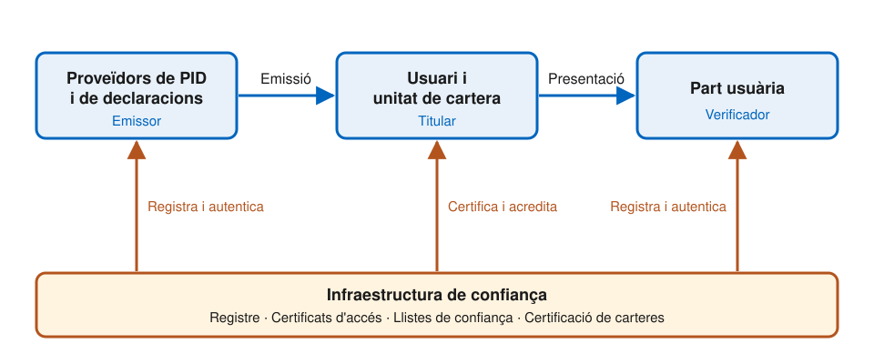

# De la SSI a la EUDI Wallet

---

## Dos punts de partida

- La **SSI** és un model d'identitat i un conjunt de tecnologies
  - Sorgeix d'una comunitat tècnica, sense cap autoritat central
- **eIDAS 2.0** és un marc legal
  - Diu què ha de fer la cartera, però no com s'ha de construir
- El pont entre tots dos és l'**ARF**

---v

## L'ARF

- **_Architecture and Reference Framework_**: el document tècnic de referència de la cartera
- Forma part de la **caixa d'eines comuna de la Unió** (_Common Union Toolbox_)
  - L'elaboren els estats membres i la Comissió
- És **informatiu**, no jurídicament vinculant
  - L'únic obligatori són el reglament i els seus actes d'execució
- Evoluciona contínuament: aquí es fa servir la **versió 3.0** (juliol de 2026)

---

## El triangle es manté

---

## De la SSI a eIDAS 2.0: vocabulari

| SSI | eIDAS 2.0 |
| --- | --- |
| **Emissor** | Proveïdor de PID o de declaracions d'atributs |
| **Titular** | Usuari de la cartera |
| **Cartera i agent** | Unitat de cartera (_Wallet Unit_) |
| **Verificador** | Part usuària |
| **Credencial verificable** | PID i declaracions electròniques d'atributs |
| **DID** | Certificats X.509 |
| **Registre de dades verificable** | Llistes de confiança |
| **Marc de governança** | Reglament, actes d'execució i esquemes de declaració |

---

## Els emissors

- **Proveïdor de PID**: verifica la identitat de l'usuari amb nivell de garantia alt i n'emet les dades d'identificació
- **Proveïdor de QEAA**: un prestador **qualificat** de serveis de confiança
- **Proveïdor de Pub-EAA**: un organisme públic responsable d'una font autèntica, o algú en nom seu
- **Proveïdor d'EAA**: qualsevol prestador de serveis de confiança **no qualificat**

---v

## Fonts autèntiques

- Repositoris o sistemes, públics o privats, **reconeguts o exigits per llei**
- Contenen atributs sobre persones: adreça, edat, nacionalitat, titulacions, llicències...
- Els proveïdors de declaracions hi poden **verificar** els atributs abans d'emetre'ls

---

## El titular: usuari i unitat de cartera

- **Proveïdor de la cartera**: un estat membre, o una organització amb mandat o reconeixement d'un estat
- **Solució de cartera**: el producte complet, que ha d'estar **certificat**
- **Unitat de cartera** (_Wallet Unit_): la configuració concreta que controla un usuari
  - La **instància** de la cartera: l'aplicació instal·lada al dispositiu
  - Un **dispositiu criptogràfic segur** (WSCD), que custodia les claus privades
- El proveïdor **acredita** cada unitat davant dels altres actors, i la pot revocar

---

## El verificador: la part usuària

- Un proveïdor de serveis que **demana atributs** a la cartera, amb l'aprovació de l'usuari
- S'ha de **registrar** a l'estat membre on està establert
- Rep un **certificat d'accés** per a cada una de les seves instàncies
  - Permet a la cartera autenticar qui li demana les dades
- Els **intermediaris** que actuen en nom seu també es consideren parts usuàries, i no poden guardar el contingut de les transaccions

---

## Què s'adopta de la SSI

- **Control de l'usuari**: cap dada surt de la cartera sense la seva aprovació
- **Credencials a la cartera**: es presenten sense passar per l'emissor
  - L'emissor no ha de saber on ni quan es fan servir
- **Divulgació selectiva**: només els atributs necessaris
- **Pseudònims**, quan no cal identificar l'usuari
- El **model de tres rols** i els formats de credencial verificable

---

## Què canvia respecte de la SSI

| | SSI | EUDI Wallet |
| --- | --- | --- |
| **Identificadors** | DID | Certificats X.509 |
| **Arrel de confiança** | Registre descentralitzat | Llistes signades per estats i Comissió |
| **Qui pot emetre** | Qualsevol | Entitats registrades |
| **Qui pot verificar** | Qualsevol | Parts usuàries registrades |
| **Cartera** | Qualsevol | Solució certificada |
| **Governança** | Marcs voluntaris | Reglament |

> Les declaracions no qualificades (EAA) poden adoptar altres models de confiança.

---

## D'on surt la confiança

- **Llistes de confiança** (_Trusted Lists_)
  - Per als prestadors qualificats, com els proveïdors de QEAA
  - Les signa i publica cada **estat membre**
- **Llistes d'entitats de confiança** (_Lists of Trusted Entities_, LoTE)
  - Per a proveïdors de cartera, de PID i de Pub-EAA, entre d'altres
  - Les signa i publica la **Comissió**, a partir de la notificació dels estats
- Les **parts usuàries** no figuren en cap llista: n'hi hauria massa
  - Es reconeixen pel seu certificat d'accés

---v

## Registre i certificats

- **Registrador**: cada estat registra els proveïdors de PID i de declaracions i les parts usuàries, i en publica les dades
- **Autoritat de certificats d'accés**: emet els certificats amb què aquestes entitats s'autentiquen davant la cartera
- **Certificats de registre**: recullen què ha declarat cada entitat, per exemple quines dades vol demanar

---

## Formats i protocols

- **Formats** que tota cartera ha de suportar:
  - **mdoc** (ISO/IEC 18013-5)
  - **SD-JWT VC**
  - El model de dades del W3C és opcional, i només per a declaracions no qualificades
- **Emissió**: OpenID4VCI
- **Presentació remota**: OpenID4VP
- **Presentació presencial**: ISO/IEC 18013-5

Es veuran amb detall als temes de credencials i protocols.

---

## És SSI, la EUDI Wallet?

- **Sí**, en la interacció: l'usuari guarda les credencials i decideix què presenta i a qui
- **No**, en la confiança: no és descentralitzada
  - Emissors, verificadors i carteres han de ser admesos per una autoritat
- Es pot entendre com una **SSI regulada**: el model de la cartera, amb la confiança ancorada en el marc legal

---

## Referències

- Comissió Europea, [_Architecture and Reference Framework_](https://eu-digital-identity-wallet.github.io/eudi-doc-architecture-and-reference-framework/), versió 3.0 (2026), sota llicència CC BY 4.0
- [Reglament (UE) 2024/1183](https://eur-lex.europa.eu/eli/reg/2024/1183/oj)
- [Reglament d'execució (UE) 2025/848](https://eur-lex.europa.eu/eli/reg_impl/2025/848/oj), sobre el registre de les parts usuàries
