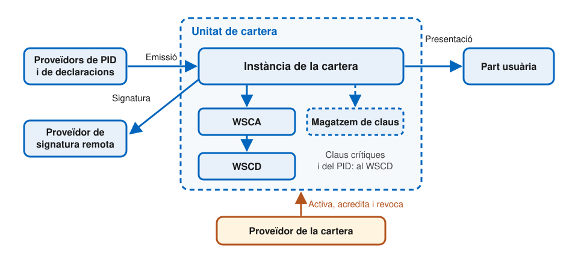
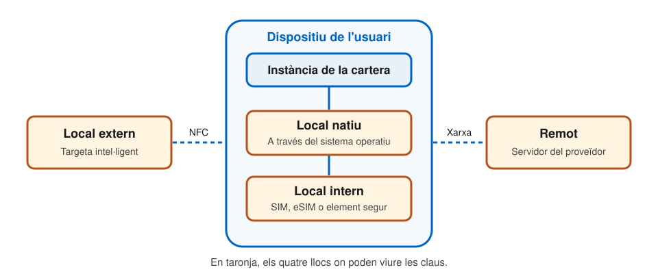
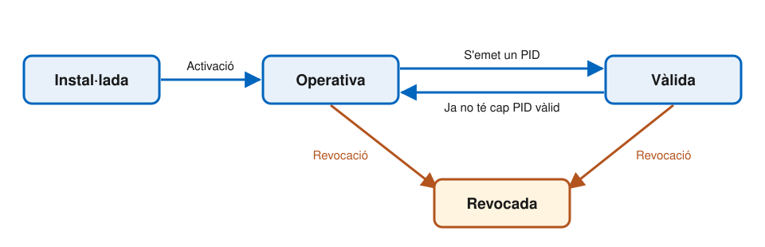

# Arquitectura i actors

---

## Mapa d'actors

| Grup                 | Actors                                                                                                                                   |
| -------------------- | ---------------------------------------------------------------------------------------------------------------------------------------- |
| **Usuari i cartera** | Usuari, proveïdor de la cartera (_Wallet Provider_), fabricants de dispositius                                                           |
| **Emissió**          | Proveïdors de PID, QEAA, Pub-EAA i EAA (_PID and Attestation Providers_); fonts autèntiques (_Authentic Sources_); proveïdors d'esquemes |
| **Consum**           | Parts usuàries (_Relying Parties_) i intermediaris                                                                                       |
| **Signatura**        | Proveïdors de creació remota de signatura qualificada (QESRC)                                                                            |
| **Confiança**        | Registradors (_Registrars_), autoritats de certificats d'accés (_Access CAs_), proveïdors de llistes                                     |
| **Supervisió**       | Organismes d'acreditació (NAB), d'avaluació de la conformitat (CAB) i de supervisió                                                      |

Una mateixa entitat pot exercir **més d'un rol**, si compleix els requisits de cadascun.

---v

## Actors de suport

- **Fabricants de dispositius** i proveïdors de subsistemes (_Device Manufacturers and Subsystems Providers_)
  - Aporten la plataforma: maquinari, sistema operatiu, elements segurs, botigues d'aplicacions
- **Proveïdors d'esquemes de declaració** (_Attestation Scheme Providers_)
  - Defineixen cada tipus de declaració i en publiquen el **llibre de regles** (_Rulebook_), llegible per persones, i l'**esquema**, llegible per màquines
  - La Comissió publica el del PID i manté un **catàleg** d'esquemes
- **Proveïdors de creació remota de signatura qualificada** (QESRC, _Qualified Electronic Signature Remote Creation_)
  - Prestadors qualificats que custodien el dispositiu de signatura en remot

---v

## Supervisió i certificació

- **Organismes nacionals d'acreditació** (NAB, _National Accreditation Bodies_)
  - Acrediten i vigilen els organismes d'avaluació de la conformitat
- **Organismes d'avaluació de la conformitat** (CAB, _Conformity Assessment Bodies_)
  - **Certifiquen** les solucions de cartera
  - **Auditen** periòdicament els prestadors qualificats de serveis de confiança
- **Organismes de supervisió** (_Supervisory Bodies_)
  - Designats pels estats membres i notificats a la Comissió
  - Vigilen el bon funcionament dels proveïdors de cartera i de la resta d'actors

---

## Els emissors

- **Proveïdor de PID** (_PID Provider_): verifica la identitat de l'usuari amb nivell de garantia alt i n'emet les dades d'identificació
- **Proveïdor de QEAA** (_Qualified EAA_): un prestador **qualificat** de serveis de confiança (_QTSP_)
- **Proveïdor de Pub-EAA** (_Public body EAA_): un organisme públic responsable d'una font autèntica, o algú en nom seu
- **Proveïdor d'EAA** (_non-qualified EAA_): qualsevol prestador de serveis de confiança **no qualificat**

---v

## Fonts autèntiques (_Authentic Sources_)

- Una **font autèntica** és el registre oficial on una dada és veritat per definició
  - El padró, per a l'adreça; el registre civil, per al naixement; la universitat, per a un títol
- Quan un emissor vol posar una dada en una declaració, la **comprova** contra la font autèntica
  - La declaració no inventa res: certifica el que ja diu el registre
- Si qui emet és el mateix **organisme responsable** del registre, la declaració és una Pub-EAA

---

## El titular: usuari i unitat de cartera

- **Proveïdor de la cartera** (_Wallet Provider_): un estat membre, o una organització amb mandat o reconeixement d'un estat
- **Solució de cartera** (_Wallet Solution_): el producte complet, que ha d'estar **certificat**
- **Unitat de cartera** (_Wallet Unit_): la configuració concreta que controla un usuari
  - La **instància** de la cartera (_Wallet Instance_): l'aplicació instal·lada al dispositiu
  - Un **dispositiu criptogràfic segur** (WSCD, _Wallet Secure Cryptographic Device_), que custodia les claus privades

---

## El verificador: la part usuària (_Relying Party_)

- Un proveïdor de serveis que **demana atributs** a la cartera, amb l'aprovació de l'usuari
- S'ha de **registrar** a l'estat membre on està establert
- Rep un **certificat d'accés** (_access certificate_) per a cada una de les seves instàncies
  - Permet a la cartera autenticar qui li demana les dades
- Els **intermediaris** que actuen en nom seu també es consideren parts usuàries, i no poden guardar el contingut de les transaccions

---

## Principis de disseny

- **Centrat en l'usuari**: és qui controla les seves dades
- **Accessibilitat**: utilitzable per tothom
- **Interoperabilitat**: qualsevol cartera funciona amb qualsevol emissor i part usuària de la Unió
- **Privadesa des del disseny**
- **Seguretat des del disseny**

---

## La unitat de cartera per dins

---v

## Components

- **Dispositiu de l'usuari** (_User Device_): maquinari i sistema operatiu
- **Instància de la cartera** (_Wallet Instance_): l'aplicació, amb la lògica i les interfícies
- **WSCD** (_Wallet Secure Cryptographic Device_): dispositiu resistent a manipulacions que custodia les claus
- **WSCA** (_Wallet Secure Cryptographic Application_): gestiona les claus dins el WSCD
- **Magatzem de claus** (_keystore_, opcional): per a claus no crítiques, mai les del PID
- **Servidor del proveïdor** (_Wallet Provider backend_): suport, manteniment i acreditació

---v

## On viuen les claus

---v

## Quatre tipus de WSCD

| Tipus de WSCD                       | On és                                             | Exemple                  |
| ----------------------------------- | ------------------------------------------------- | ------------------------ |
| **Remot** (_remote_)                | Servidor del proveïdor                            | HSM                      |
| **Local extern** (_local external_) | Dispositiu a part                                 | Targeta intel·ligent     |
| **Local intern** (_local internal_) | Dins el dispositiu                                | SIM, eSIM, element segur |
| **Local natiu** (_local native_)    | Dins el dispositiu, a través del sistema operatiu | API del sistema          |

- El proveïdor pot triar qualsevol arquitectura, però ha de garantir un **nivell de garantia alt**
- L'accés a les claus exigeix sempre **dos mecanismes d'autenticació** de l'usuari

---

## Interfícies de la cartera

| Interfície                  | Amb qui                             | Protocol                   |
| --------------------------- | ----------------------------------- | -------------------------- |
| **Emissió**                 | Proveïdors de PID i de declaracions | OpenID4VCI                 |
| **Presentació remota**      | Parts usuàries                      | OpenID4VP, ISO/IEC 18013-7 |
| **Presentació presencial**  | Parts usuàries, altres carteres     | ISO/IEC 18013-5            |
| **Signatura remota**        | Proveïdor de signatura              | —                          |
| **Proveïdor de la cartera** | El seu servidor                     | No estandarditzada         |
| **Usuari**                  | La persona                          | No estandarditzada         |

---

## Fluxos de presentació

- **Presencials** (_proximity_): per NFC o Bluetooth, amb connexió a Internet o sense
  - **Supervisat** (_supervised_): davant d'una persona que representa la part usuària
  - **No supervisat** (_unsupervised_): davant d'una màquina
- **Remots** (_remote_): a través d'Internet
  - **Mateix dispositiu** (_same-device_): el servei i la cartera són al mateix mòbil
  - **Entre dispositius** (_cross-device_): el servei s'obre en un ordinador i la cartera és al mòbil

---

## Cicle de vida de la unitat de cartera

---v

## Els estats

- **Instal·lada** (_Installed_): l'usuari ha instal·lat l'aplicació; només es pot activar
- **Operativa** (_Operational_): el proveïdor l'ha activat i acreditat
  - Ja pot demanar un PID i declaracions
- **Vàlida** (_Valid_): conté almenys un PID vàlid
  - Ja es pot identificar davant de les parts usuàries
- **Revocada** (_Revoked_): a petició de l'usuari o per un problema de seguretat
  - La revocació **no es pot desfer**
  - Els proveïdors de PID revoquen els PID que hi havia

---v

## Acreditar i revocar una cartera

- El proveïdor **acredita** cada unitat: li dona un certificat que demostra que és una cartera autèntica, amb les claus en un dispositiu segur
  - Els emissors ho comproven abans d'emetre-hi res
  - Com el certificat d'un lloc web, però per a la cartera
- Si la cartera es perd o es compromet, el proveïdor la **revoca**
  - Deixa de ser acceptada, i els PID que contenia es revoquen també

---v

## Com s'acredita una cartera

En activar la unitat, el proveïdor li emet dues menes d'acreditació:

- **Acreditació de la instància** (_Wallet Instance Attestation_, WIA)
  - Certifica la integritat i l'autenticitat de l'aplicació
- **Acreditació de claus** (_Key Attestation_, KA)
  - Certifica les propietats del WSCD o del magatzem de claus
  - Conté les claus públiques corresponents

Totes dues porten una **referència de revocació**: així els emissors poden comprovar que la cartera continua sent de fiar.

---

## Certificació de les solucions de cartera

- Tota solució de cartera (_Wallet Solution_) ha d'estar **certificada** per un organisme d'avaluació de la conformitat (CAB)
- Abasta el **programari**, el **maquinari** i els **processos**, com ara l'activació
- Dues fases:
  1. A curt termini, **esquemes nacionals** transitoris
  2. A mitjà termini, un **esquema europeu** harmonitzat sota la _Cybersecurity Act_, preparat per ENISA

---

## I les persones jurídiques?

- El reglament preveu carteres tant per a persones físiques com jurídiques
- L'ARF 3.0, però, només tracta les de **persones físiques**
  - Les de persones jurídiques s'han separat cap a una futura **cartera d'empresa** (_business wallet_)
- També assumeix que el dispositiu és **personal**: només l'usuari hi té accés

---

## Referències

- Comissió Europea, [_Architecture and Reference Framework_](https://eu-digital-identity-wallet.github.io/eudi-doc-architecture-and-reference-framework/), versió 3.0 (2026), capítols 3, 4, 6 i 7, sota llicència CC BY 4.0
- [Reglament d'execució (UE) 2024/2979](https://eur-lex.europa.eu/eli/reg_impl/2024/2979/oj), sobre la integritat i les funcionalitats bàsiques de la cartera
- [Reglament d'execució (UE) 2024/2981](https://eur-lex.europa.eu/eli/reg_impl/2024/2981/oj), sobre la certificació de les carteres
