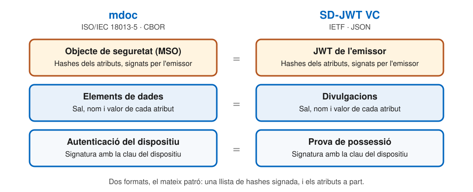

# Credencials

---

## De credencials a declaracions

- A la SSI en dèiem **credencials verificables** (_Verifiable Credentials_, VC)
- A eIDAS 2.0, les dades s'intercanvien en forma de **declaracions electròniques d'atributs** (EAA, _Electronic Attestation of Attributes_)
- El reglament hi afegeix una categoria a part: les **dades d'identificació de la persona** (PID, _Person Identification Data_)
- Tècnicament, PID i declaracions es construeixen igual

---

## Anatomia d'una declaració


---v

## Les tres parts

- **Atributs** (_attributes_): la informació sobre el subjecte
  - La part usuària (_Relying Party_) en demana només els que necessita
- **Metadades** (_metadata_): la informació sobre la declaració mateixa
  - Tipus, proveïdor i període de validesa
  - Clau pública que la vincula al dispositiu
  - Referència per comprovar si ha estat revocada
- **Prova** (_proof_): garanteix la integritat i l'autenticitat
  - Ha de permetre la **divulgació selectiva** (_selective disclosure_)
  - Inclou el certificat del proveïdor i la referència a l'àncora de confiança

---

## Quatre categories legals

- **PID** (_Person Identification Data_): dades d'identificació de la persona
- **QEAA** (_Qualified EAA_): declaració qualificada, emesa per un prestador qualificat (QTSP)
- **Pub-EAA** (_Public body EAA_): emesa per un organisme públic responsable d'una font autèntica (_authentic source_)
- **EAA** (_non-qualified EAA_): declaració no qualificada

La diferència és **purament legal**, no tècnica:

- Un títol universitari pot ser una QEAA o una EAA, segons qui l'emeti
- Un permís de conduir pot ser Pub-EAA, QEAA o EAA, segons l'estat membre

---

## El PID

- Permet establir la **identitat** d'una persona
- Atributs **obligatoris**:
  - Cognoms i nom
  - Data i lloc de naixement
  - Nacionalitat
  - Fotografia, llevat que l'usuari hi renunciï
- Atributs **opcionals**: adreça, sexe, número administratiu personal, correu electrònic, telèfon...
- Metadades: autoritat i país que l'emeten

---v

## Particularitats del PID

- És l'única dada que ha de tenir **nivell de garantia alt**
  - Les seves claus han d'estar al WSCD
- Determina l'estat de la cartera: sense cap PID vàlid, la unitat és operativa però no **vàlida**
- Una cartera pot contenir **diversos PID**
  - Per exemple, si l'usuari té més d'una nacionalitat
  - Tots han de ser de la mateixa persona

---

## Formats

|                         | mdoc            | SD-JWT VC      | W3C VCDM 2.0           |
| ----------------------- | --------------- | -------------- | ---------------------- |
| **Estàndard**           | ISO/IEC 18013-5 | IETF           | W3C                    |
| **Codificació**         | CBOR (binari)   | JSON           | JSON-LD                |
| **Prova**               | Hashes amb sal  | Hashes amb sal | S'ha de definir a part |
| **Ús principal**        | Presencial      | Remot          | General                |
| **Suport a la cartera** | Obligatori      | Obligatori     | Opcional               |

---v

## Dos formats, un mateix patró



---v

## mdoc

- Neix com a estàndard del **permís de conduir mòbil** (mDL, _mobile Driving Licence_)
  - Només l'esquema d'atributs és específic del permís; la resta és genèric
- Codificació binària **CBOR**, amb espais de noms per evitar col·lisions
- La vinculació al dispositiu és **obligatòria**
- Serveix per a presentacions **presencials** i remotes

---v

## SD-JWT VC

- Un **JSON Web Token** (JWT) amb divulgació selectiva (_Selective Disclosure JWT_, SD-JWT)
- Cada tipus de declaració s'identifica amb un **tipus de credencial** (`vct`, _verifiable credential type_)
  - Un tipus en pot estendre un altre: tipus nacionals a partir d'un tipus europeu comú
- La vinculació al dispositiu és opcional a l'estàndard
- Només per a presentacions **remotes**
- Té moltes opcions: cal seguir el perfil **HAIP** (_High Assurance Interoperability Profile_) per garantir la interoperabilitat

---v

## W3C VCDM

- Un **model de dades** general (VCDM, _Verifiable Credentials Data Model_), basat en JSON-LD
- Deixa oberts els mecanismes de seguretat, la signatura i el transport
  - Cal un perfil addicional per ser interoperable
- A la cartera és **opcional**, i només per a declaracions **no qualificades**
- Molt utilitzat al sector **educatiu**

---

## Divulgació selectiva (_selective disclosure_)


---v

## Com funciona

1. L'emissor calcula el **hash** de cada atribut, combinat amb una **sal** aleatòria (_salted hash_)
2. Signa la llista de hashes, no els valors
3. La cartera envia la llista signada i, només per als atributs triats, el **valor i la sal**
4. La part usuària recalcula els hashes i comprova que són a la llista signada

Els dos formats obligatoris fan servir el mateix mecanisme.

---

## Un exemple: el PID de la Maria

La Maria vol obrir un compte en un banc, que li demana identificar-se amb la cartera. Aquestes són les dades del seu PID:

```json
{
  "vct": "urn:eudi:pid:1",
  "given_name": "Maria",
  "family_name": "Ferrer Bosch",
  "birthdate": "1990-04-12",
  "nationalities": ["ES"],
  "place_of_birth": { "country": "ES" },
  "issuing_authority": "ES",
  "issuing_country": "ES"
}
```

Exemple il·lustratiu, amb dades inventades.

---v

## El que signa l'emissor

Els atributs no hi apareixen: només els seus **hashes**.

```json
{
  "iss": "https://pid.exemple.es",
  "vct": "urn:eudi:pid:1",
  "exp": 1798761600,
  "_sd_alg": "sha-256",
  "_sd": ["Kx3f…9aQ", "p0Yt…Zc4", "u7Lm…e2w", "4hNd…Vb8"],
  "cnf": { "jwk": { "kty": "EC", "crv": "P-256", "x": "…", "y": "…" } },
  "status": {
    "status_list": {
      "idx": 4127,
      "uri": "https://pid.exemple.es/estat/3"
    }
  }
}
```

- `_sd`: els hashes dels atributs
- `cnf`: la clau pública que vincula el PID al dispositiu
- `status`: on comprovar si ha estat revocat

---v

## Una divulgació

Per a cada atribut, la cartera guarda una **divulgació** (_disclosure_): la sal, el nom i el valor.

```json
["2GLC42sKQveCfGfryNRN9w", "nationalities", ["ES"]]
```

- Es codifica en Base64 i se'n calcula el hash
- Aquest hash és un dels valors de la llista `_sd` que ha signat l'emissor
- Sense la divulgació, del hash no se'n pot deduir res

---v

## El que rep el banc

Tres parts, separades pel caràcter `~`:

```text
<JWT signat per l'emissor>~<divulgacions triades>~<prova de possessió>
```

La prova de possessió la signa la cartera, amb la clau privada del dispositiu:

```json
{
  "nonce": "b7Qx2mVf9K",
  "aud": "x509_hash:Uvo3…Zszk",
  "iat": 1791802800,
  "sd_hash": "Dy-R…tW4"
}
```

- `nonce` i `aud`: lliguen la resposta a aquesta petició i a aquest banc
- `sd_hash`: lliga la prova a les divulgacions enviades

---

## Vinculació al dispositiu (_device binding_)

- Evita que una declaració es pugui **copiar** a una altra cartera
- La declaració conté una **clau pública**; la privada no surt mai del WSCD o del magatzem de claus
- En cada presentació, la cartera **signa un repte** aleatori de la part usuària
  - Per això també se'n diu **prova de possessió** (_proof of possession_; _key binding_ a SD-JWT, _mdoc authentication_ a ISO)
- **Obligatòria** per al PID i per a totes les declaracions mdoc
- **Recomanada** per a les declaracions SD-JWT VC

---

## Revocació

- Si una declaració és vàlida més de **24 hores**, ha d'incloure informació de revocació
- Dos mecanismes:
  - **Llista d'estat** (_status list_): una cadena de bits; cada declaració hi té una posició
  - **Llista de revocació** (_revocation list_): els identificadors de les declaracions revocades
- La part usuària descarrega la llista i hi consulta la declaració rebuda
  - És recomanable, però no obligatori
  - Sense connexió, ha de decidir segons el risc

---

## Declaració lògica i declaració tècnica

- **Lògica** (_logical_): el que veu l'usuari, per exemple «el meu PID»
- **Tècnica** (_technical_): l'objecte signat que realment es presenta
- Una declaració lògica correspon a **moltes de tècniques**
  - L'emissor en pot lliurar un **lot** (_batch issuance_)
  - Tenen una validesa tècnica curta i es **reemeten** periòdicament (_re-issuance_)
- Presentar-ne una de diferent cada vegada dificulta que les parts usuàries **relacionin** les presentacions d'un mateix usuari

---

## Esquemes, llibres de regles i catàlegs

- **Llibre de regles** (_Rulebook_): la documentació per a persones
  - Quins atributs té cada tipus de declaració, què signifiquen i com es codifiquen
- **Esquema de declaració** (_attestation scheme_): la mateixa especificació, llegible per programes
- **Catàleg d'esquemes** (_catalogue of attestation schemes_): on es publiquen, perquè tothom els trobi
  - És públic, i registrar-s'hi no és obligatori
  - Aparèixer-hi no obliga ningú a acceptar la declaració

---v

## Qui defineix els llibres de regles?

- La **Comissió Europea**: el del PID i el del permís de conduir mòbil
- **Administracions i organitzacions sectorials**: llibres de regles europeus o de sector, per exemple per a titulacions
- **Proveïdors de declaracions**: extensions amb atributs nacionals o propis
- Hi ha també un **catàleg d'atributs** (_catalogue of attributes_), perquè els prestadors qualificats sàpiguen a quina font autèntica verificar cada atribut

---

## Referències

- Comissió Europea, [_Architecture and Reference Framework_](https://eu-digital-identity-wallet.github.io/eudi-doc-architecture-and-reference-framework/), versió 3.0 (2026), capítols 5 i 6, sota llicència CC BY 4.0
- Comissió Europea, [_PID Rulebook_](https://github.com/eu-digital-identity-wallet/eudi-doc-attestation-rulebooks-catalog/blob/main/rulebooks/pid/pid-rulebook.md)
- [Reglament d'execució (UE) 2024/2977](https://eur-lex.europa.eu/eli/reg_impl/2024/2977/oj), sobre el PID i les declaracions electròniques d'atributs
- [RFC 9901: Selective Disclosure for JSON Web Tokens](https://www.rfc-editor.org/rfc/rfc9901.html)
