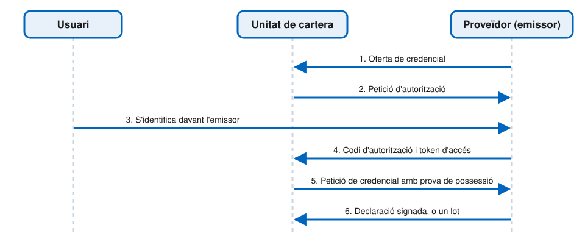
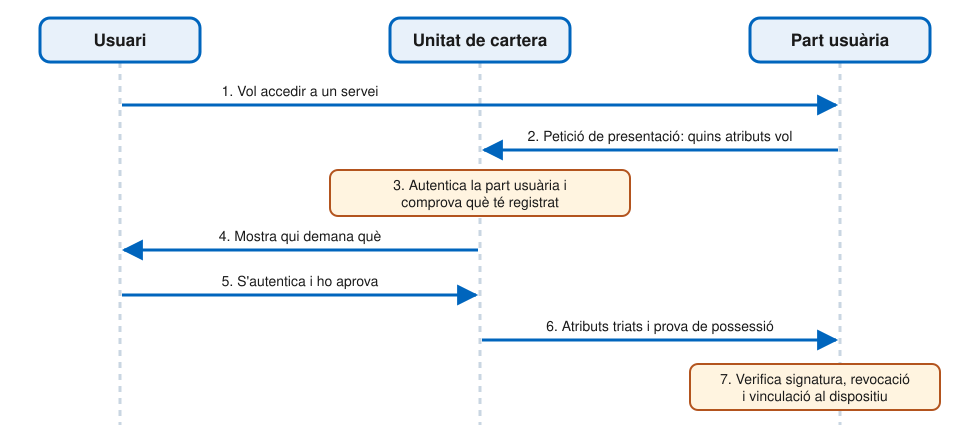

# Protocols

---

## Tres moments, tres protocols

| Moment | Entre qui | Protocol |
| --- | --- | --- |
| **Emissió** | Proveïdor i cartera | OpenID4VCI |
| **Presentació remota** | Cartera i part usuària, per Internet | OpenID4VP |
| **Presentació presencial** | Cartera i part usuària, de prop | ISO/IEC 18013-5 |

- Un **protocol** defineix els missatges que s'intercanvien
- Un **mecanisme de transmissió** defineix com s'estableix el canal per enviar-los

---

## Emissió: OpenID4VCI

- _OpenID for Verifiable Credential Issuance_
- Es basa en **OAuth 2.0**: servidor d'autorització, codis d'autorització i tokens d'accés
- Hi afegeix l'**oferta de credencial**, amb què l'emissor informa la cartera del que pot emetre
- Garanteix:
  - La confidencialitat i l'autenticitat de les dades intercanviades
  - L'**autenticació de la cartera** davant l'emissor
  - El transport de les **claus públiques** que s'inclouran a les declaracions

---v

## Flux d'emissió



---v

## Què comprova cadascú

- La **cartera**:
  - Autentica el proveïdor amb el seu **certificat d'accés**
  - Comprova que està **registrat** per emetre aquell tipus de declaració
  - Verifica la declaració rebuda abans de guardar-la
- El **proveïdor**:
  - Verifica que la cartera és autèntica, amb l'**acreditació de la instància** (WIA)
  - Verifica que la clau està protegida pel WSCD, amb l'**acreditació de claus** (KA)
  - Comprova que la cartera **no ha estat revocada**

---v

## Altres aspectes de l'emissió

- **Emissió per lots**: el proveïdor pot lliurar moltes declaracions tècniques d'una vegada
- **Activació del PID**: l'usuari ha d'activar el PID abans de poder-lo presentar
- **Altres protocols**: un proveïdor de PID pot fer servir un protocol propi amb la cartera del seu estat, si compleix els actes d'execució
  - Sovint el proveïdor de PID i el de la cartera estan estretament relacionats

---

## Presentació remota: OpenID4VP

- _OpenID for Verifiable Presentations_
- Defineix els missatges i una interfície **HTTP** per demanar i presentar declaracions
- Serveix per als dos formats obligatoris: **SD-JWT VC** i **mdoc**
- Garanteix:
  - La confidencialitat i l'autenticitat de les dades intercanviades
  - L'**autenticació de la part usuària** davant la cartera
- Alternativa per a declaracions mdoc: **ISO/IEC 18013-7**

---v

## Flux de presentació remota



---v

## Què comprova la cartera

1. **Autentica** la part usuària amb el seu certificat d'accés
2. Comprova que **no demana més atributs** dels que va registrar
3. Avalua la **política de divulgació** de la declaració, si en té
4. **Informa** l'usuari: qui demana les dades, quines i per a què
5. **Autentica** l'usuari
6. Li demana l'**aprovació**

L'usuari sempre pot aprovar o denegar la petició.

---v

## Què comprova la part usuària

- L'**autenticitat** de la declaració: la signatura del proveïdor, contrastada amb les llistes de confiança
- Que **no ha estat revocada**
- La **vinculació al dispositiu**: que la cartera posseeix la clau privada
- Si rep diverses declaracions, que pertanyen al **mateix usuari**

---

## Un exemple: el banc demana el PID

El banc on la Maria vol obrir un compte envia a la cartera una petició signada:

```json
{
  "client_id": "x509_hash:Uvo3…Zszk",
  "response_type": "vp_token",
  "response_mode": "direct_post.jwt",
  "response_uri": "https://banc.exemple.es/resposta",
  "nonce": "b7Qx2mVf9K",
  "dcql_query": { … }
}
```

- `client_id`: el hash del certificat d'accés del banc
- `response_uri`: on la cartera ha d'enviar la resposta, xifrada
- `nonce`: valor d'un sol ús, que la cartera haurà de signar

Exemple il·lustratiu, amb dades inventades.

---v

## Què demana: la consulta

```json
{
  "credentials": [{
    "id": "pid",
    "format": "dc+sd-jwt",
    "meta": { "vct_values": ["urn:eudi:pid:1"] },
    "claims": [
      { "path": ["given_name"] },
      { "path": ["family_name"] },
      { "path": ["birthdate"] },
      { "path": ["nationalities"] }
    ]
  }]
}
```

Un PID en format SD-JWT VC, i només **quatre atributs**: la cartera no n'enviarà cap altre.

---v

## La resposta de la cartera

Quan la Maria ho aprova, la cartera envia:

```json
{
  "vp_token": {
    "pid": ["eyJhbGci…~WyIyR0xD…~WyJlbHVW…~eyJ0eXAi…"]
  }
}
```

- La clau `pid` és l'identificador que el banc havia posat a la consulta
- El valor és el PID presentat: el JWT de l'emissor, les divulgacions dels quatre atributs i la prova de possessió
- Tot plegat viatja **xifrat** cap al banc

---

## Com arriba la petició a la cartera?

- **URI personalitzat**: el navegador obre un enllaç com `openid4vp://`, i el sistema operatiu el passa a la cartera
- **API de credencials digitals** del W3C: el navegador i el sistema operatiu fan de mediadors

Tots dos serveixen per als dos fluxos remots:

- **Mateix dispositiu**: el servei s'obre al mateix mòbil que té la cartera
- **Entre dispositius**: el servei s'obre en un ordinador, i l'usuari escaneja un **codi QR** amb el mòbil

---v

## Problemes dels URI personalitzats

- **Fluxos entre dispositius**: vulnerables a atacs de _phishing_ i de retransmissió
- **Selecció de cartera**: què passa si n'hi ha més d'una al dispositiu?
- **Invocació**: es comporta diferent segons el navegador i el sistema operatiu
- **Origen**: la cartera no sap amb certesa quin lloc web fa la petició
- **Sessió**: el canvi de context permet el segrest de sessió

---v

## L'API de credencials digitals

- Estén l'API de gestió de credencials del navegador, la mateixa de les _passkeys_
- El navegador i el sistema operatiu:
  - Deixen **triar la cartera**
  - Li passen l'**origen** de la petició
  - En fluxos entre dispositius, comproven la **proximitat** dels dos aparells
- Encara és un **esborrany** del W3C, i no tots els navegadors la implementen
- La cartera l'ha de suportar; la part usuària pot triar quin mecanisme fa servir

---

## Presentació presencial: ISO/IEC 18013-5

1. L'usuari obre la cartera, que mostra un **codi QR** o activa l'**NFC**
2. La part usuària el llegeix i estableix una connexió per **Bluetooth, NFC o Wi-Fi Aware**
3. Es crea un **canal xifrat i autenticat** sobre aquesta connexió
4. La part usuària envia la petició, i la cartera respon amb els atributs aprovats

- Funciona **sense connexió a Internet**
- Tota cartera l'ha de suportar

---

## Dades transaccionals

- La part usuària pot afegir **dades addicionals** a la petició:
  - L'import i el beneficiari d'un **pagament**
  - El document que es vol **signar**
- La cartera les mostra a l'usuari i, si les aprova, les **signa**
  - Ho fa dins el mateix mecanisme de vinculació al dispositiu
- Permet l'autenticació reforçada en pagaments i la signatura electrònica

---

## El perfil HAIP

- _High Assurance Interoperability Profile_
- OpenID4VCI, OpenID4VP i SD-JWT VC tenen **moltes opcions**
- HAIP en fixa una combinació concreta, perquè qualsevol cartera funcioni amb qualsevol emissor i part usuària
- Els estàndards d'**ETSI** hi afegeixen el que és específic de l'ecosistema, com els certificats d'accés i de registre

---

## Resum

| | Emissió | Presentació remota | Presentació presencial |
| --- | --- | --- | --- |
| **Protocol** | OpenID4VCI | OpenID4VP | ISO/IEC 18013-5 |
| **Transport** | HTTP | HTTP | Bluetooth, NFC, Wi-Fi Aware |
| **Formats** | mdoc, SD-JWT VC | mdoc, SD-JWT VC | mdoc |
| **Cal Internet** | Sí | Sí | No |
| **Qui s'autentica** | Cartera i proveïdor | Part usuària | Part usuària |

---

## Referències

- Comissió Europea, [_Architecture and Reference Framework_](https://eu-digital-identity-wallet.github.io/eudi-doc-architecture-and-reference-framework/), versió 3.0 (2026), capítols 4, 5 i 6, sota llicència CC BY 4.0
- OpenID Foundation, [_OpenID for Verifiable Credential Issuance_](https://openid.net/specs/openid-4-verifiable-credential-issuance-1_0.html)
- OpenID Foundation, [_OpenID for Verifiable Presentations_](https://openid.net/specs/openid-4-verifiable-presentations-1_0.html)
- OpenID Foundation, [_High Assurance Interoperability Profile_](https://openid.net/specs/openid4vc-high-assurance-interoperability-profile-1_0.html)
- [Reglament d'execució (UE) 2024/2982](https://eur-lex.europa.eu/eli/reg_impl/2024/2982/oj), sobre els protocols i les interfícies de la cartera
