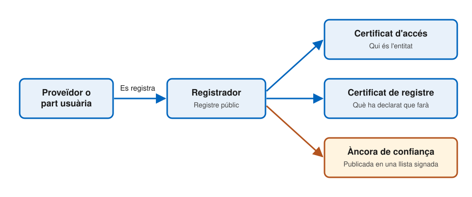
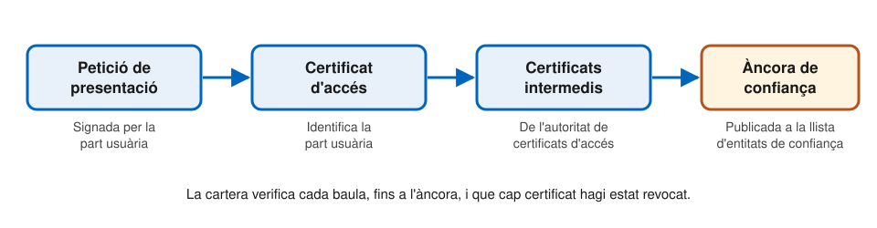

# Infraestructura de confiança

---

## Tres preguntes

En cada interacció, algú s'ha de poder fiar d'algú altre:

- L'**emissor**: aquesta cartera és autèntica i segura?
- La **cartera**: aquest emissor, o aquesta part usuària, és qui diu ser?
- La **part usuària**: aquesta declaració l'ha emès algú de confiança?

La resposta es construeix amb **certificats X.509** i **llistes signades** per una autoritat.

---

## Àncores de confiança

- Una **àncora de confiança** és una clau pública, o un certificat arrel, en què es confia per endavant
- Tota verificació és una **cadena** que acaba en una àncora
- La qüestió és d'on surten les àncores:
  - No de cada actor, sinó de **llistes publicades i signades** per un estat membre o per la Comissió
- Cada actor ha de descarregar aquestes llistes i mantenir-les **actualitzades**

---

## Dues menes de llistes

| | Llistes de confiança | Llistes d'entitats de confiança (LoTE) |
| --- | --- | --- |
| **Per a qui** | Prestadors qualificats | Proveïdors de cartera, de PID i de Pub-EAA, entre d'altres |
| **Qui les signa** | Cada estat membre | La Comissió |
| **Estàndard** | ETSI TS 119 612 | ETSI TS 119 602 |

- Les **parts usuàries** no figuren en cap llista
- Una entitat no se n'esborra mai: passa a estat **invàlid**

---

## El registre



---v

## El registrador

- Cada estat membre té un **registrador**
- Hi consten els proveïdors de PID i de declaracions, i les parts usuàries
- El registre és **públic**, llegible per persones i per programes
- Què s'hi declara:
  - Dades de contacte i descripció dels serveis
  - Els emissors: quins **tipus de declaració** volen emetre
  - Les parts usuàries: quins **atributs** demanaran, i per a quin ús
- És un mecanisme de **transparència**, no d'autorització prèvia

---v

## Dos certificats

| | Certificat d'accés | Certificat de registre |
| --- | --- | --- |
| **Qui l'emet** | Autoritat de certificats d'accés | Proveïdor de certificats de registre |
| **Què diu** | Qui és l'entitat | Què ha registrat que farà |
| **Per a què serveix** | Autenticar-se davant la cartera | Comprovar que no se surt del que ha registrat |
| **Quants** | Un per cada instància | Un per cada ús previst |

---

## Com entra cada actor

| Actor | Com entra a l'ecosistema | On es publica la seva àncora |
| --- | --- | --- |
| **Proveïdor de cartera** | Solució certificada; l'estat el notifica | LoTE |
| **Proveïdor de PID** | Registre i notificació | LoTE |
| **Proveïdor de Pub-EAA** | Registre i notificació | LoTE |
| **Proveïdor de QEAA** | Registre i estatus qualificat | Llista de confiança |
| **Proveïdor d'EAA** | Registre | Segons el llibre de regles |
| **Part usuària** | Registre | Enlloc: certificat d'accés |

---v

## I com en surt

- **Proveïdor de cartera invalidat**
  - Els emissors deixen d'emetre a les seves carteres
  - Ha de revocar les unitats de cartera
- **Emissor suspès**
  - Perd els certificats d'accés: ja no pot emetre
  - Passa a invàlid a la llista: les seves declaracions deixen d'acceptar-se
  - Ha de revocar les declaracions emeses
- **Part usuària suspesa**
  - Perd els certificats d'accés i de registre: ja no pot demanar dades

---

## La cartera autentica la part usuària



---v

## Pas a pas

1. La part usuària **signa** la petició i hi adjunta el certificat d'accés i els intermedis
2. La cartera verifica la **signatura** amb la clau pública del certificat
3. Valida la **cadena** de certificats fins a l'àncora, que ha obtingut de la LoTE
4. Comprova que cap certificat ha estat **revocat**
5. Només llavors demana l'aprovació de l'usuari

---v

## Què passa si falla?

- **Signatura invàlida**: la cartera atura la transacció
  - Pot ser un atac d'intermediari
- **Cadena no verificable**: la cartera atura la transacció
  - El certificat d'accés pot ser fals
- **No es pot comprovar la revocació**: ho decideix el proveïdor de la cartera
  - Pot continuar, segons la sensibilitat de les dades demanades
- En tots els casos, la cartera n'**informa l'usuari**

---

## Demana més del que va declarar?

1. La petició inclou el **certificat de registre** de l'ús previst
2. La cartera en verifica la signatura, la vigència i la revocació
3. Comprova que és de la **mateixa entitat** que el certificat d'accés
4. **Compara** els atributs demanats amb els registrats
5. Si en demana de més, **avisa** l'usuari

L'aprovació ha de ser sempre **explícita**. Aquesta verificació encara té un període transitori.

---

## Un exemple: els certificats del banc

El **certificat d'accés** del banc on la Maria vol obrir un compte diu qui és:

```text
Subjecte:   CN=Banc Exemple, O=Banc Exemple SA, C=ES
Emissor:    CN=Autoritat de certificats d'accés d'exemple, C=ES
Validesa:   de l'1 de març de 2026 a l'1 de març de 2027
Clau:       ECDSA P-256
Revocació:  http://crl.exemple.es/acces.crl
```

- La cartera en valida la cadena fins a l'àncora de l'autoritat emissora
- I consulta la llista de revocació

Exemple il·lustratiu i simplificat, amb dades inventades.

---v

## El certificat de registre, per dins

Diu què va declarar el banc en registrar-se:

| Camp | Contingut |
| --- | --- |
| **Entitat** | Banc Exemple SA, amb el mateix identificador que al certificat d'accés |
| **Ús previst** | Identificació del client en obrir un compte |
| **Atributs** | Nom, cognoms, data de naixement i nacionalitat |
| **Signat per** | El proveïdor de certificats de registre |

Si el banc demanés també l'adreça, la cartera avisaria la Maria que no l'havia registrada.

---

## La part usuària verifica una declaració

- Verifica la **signatura** del proveïdor amb la seva àncora:
  - PID i Pub-EAA: a la LoTE
  - QEAA: a la llista de confiança
  - EAA: on digui el llibre de regles
- Ha de saber quina **categoria** demana, i guardar les àncores per separat
- Ha de **mantenir les àncores al dia**: descarregar les llistes i retirar les entitats invalidades
- Pot comprovar que l'emissor està **registrat** per a aquell tipus

---

## L'emissor verifica la cartera

- Abans d'emetre, el proveïdor rep de la cartera dues acreditacions:
  - L'**acreditació de la instància** (WIA)
  - L'**acreditació de claus** (KA)
- Totes dues les signa el **proveïdor de la cartera**
- L'emissor les verifica amb l'àncora del proveïdor, publicada a la LoTE
- Amb les **llistes d'estat** comprova que la cartera no ha estat revocada

---

## Qui verifica què

| Qui | Què verifica | Amb l'àncora de |
| --- | --- | --- |
| **Emissor** | La cartera | Proveïdor de la cartera |
| **Cartera** | Qui és l'emissor o la part usuària | Autoritat de certificats d'accés |
| **Cartera** | Què han registrat | Proveïdor de certificats de registre |
| **Part usuària** | PID i Pub-EAA | El seu proveïdor |
| **Part usuària** | QEAA | Prestador qualificat |

---

## Confiança tècnica i confiança institucional

- La criptografia garanteix que un certificat **encadena** amb una àncora
- Però que l'àncora sigui de fiar depèn de les **institucions**:
  - Supervisió pública
  - Polítiques de seguretat publicades
  - Auditories i certificació
- És el que a la SSI en dèiem el **marc de governança**, aquí fixat per llei

---

## Referències

- Comissió Europea, [_Architecture and Reference Framework_](https://eu-digital-identity-wallet.github.io/eudi-doc-architecture-and-reference-framework/), versió 3.0 (2026), capítols 3 i 6, sota llicència CC BY 4.0
- [Reglament d'execució (UE) 2024/2980](https://eur-lex.europa.eu/eli/reg_impl/2024/2980/oj), sobre les notificacions a la Comissió
- [Reglament d'execució (UE) 2025/848](https://eur-lex.europa.eu/eli/reg_impl/2025/848/oj), sobre el registre de les parts usuàries
- [ETSI TS 119 612](https://www.etsi.org/deliver/etsi_ts/119600_119699/119612/), llistes de confiança
- [Navegador de llistes de confiança de la UE](https://eidas.ec.europa.eu/efda/trust-services/browse/eidas/tls)
