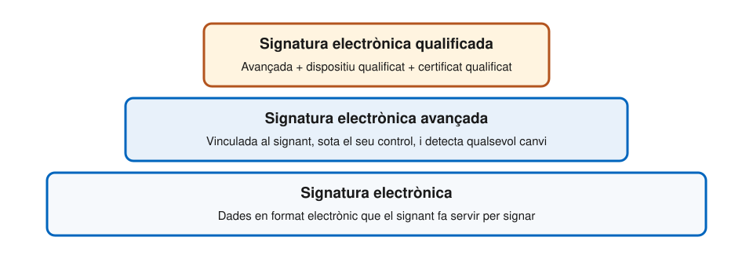
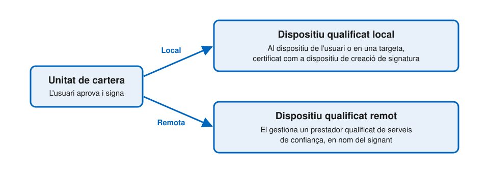

# Serveis de confiança

---

## Què és un servei de confiança?

Un servei electrònic, normalment de pagament, que consisteix en alguna d'aquestes activitats:

- **Signatures i segells electrònics**: emetre'n els certificats, crear-los, validar-los i preservar-los
- **Segells de temps** electrònics
- **Entrega electrònica certificada**
- **Certificats d'autenticació de llocs web**
- **Declaracions electròniques d'atributs**: emetre-les i validar-les
- **Arxiu electrònic**
- **Llibres majors electrònics**

Els tres últims grups són **nous** a eIDAS 2.0.

---

## Qualificat i no qualificat

- Qualsevol servei de confiança té valor: **no se'l pot rebutjar** com a prova només pel fet de ser electrònic
- Un servei **qualificat** hi afegeix una **presumpció legal**
  - Qui el vulgui qüestionar ha de demostrar el contrari
- Per ser qualificat, un prestador:
  - Rep l'**estatus qualificat** de l'organisme de supervisió
  - És **auditat** per un organisme d'avaluació de la conformitat, almenys cada 24 mesos
  - Figura a la **llista de confiança** del seu estat membre

---v

## Llistes de confiança i etiqueta de la UE

- Cada estat membre publica la seva **llista de confiança**
  - Signada o segellada electrònicament, i processable per programes
  - Hi consten els prestadors qualificats i els serveis qualificats que ofereixen
- La Comissió publica on és cada llista nacional
- Els prestadors qualificats poden fer servir l'**etiqueta de confiança de la UE**
  - Han d'enllaçar la llista de confiança des del seu lloc web

---

## Signatura electrònica

---v

## Signatura avançada

Ha de complir quatre requisits:

1. Està **vinculada al signant** de manera única
2. Permet **identificar** el signant
3. S'ha creat amb dades que el signant pot utilitzar sota el seu **control exclusiu**
4. Està vinculada a les dades signades, de manera que qualsevol **canvi posterior** es pot detectar

---v

## Signatura qualificada

- És una signatura avançada que, a més:
  - S'ha creat amb un **dispositiu qualificat de creació de signatura** (QSCD)
  - Es basa en un **certificat qualificat** de signatura electrònica
- Té el mateix efecte jurídic que una **signatura manuscrita**
- Si el certificat és d'un estat membre, es reconeix com a qualificada a **tots els altres**

---

## Segell electrònic

- És l'equivalent de la signatura per a les **persones jurídiques**
- Garanteix l'**origen** i la **integritat** de les dades
- Té els mateixos tres nivells: simple, avançat i qualificat
- El segell **qualificat** gaudeix de la presumpció d'integritat de les dades i de correcció del seu origen

---

## Segell de temps i entrega certificada

- **Segell de temps electrònic**
  - Vincula unes dades a un instant concret: demostra que **existien en aquell moment**
  - Qualificat: presumpció d'exactitud de la data i l'hora, i d'integritat de les dades
- **Entrega electrònica certificada**
  - Transmet dades entre tercers i aporta **prova de l'enviament i de la recepció**
  - Les protegeix contra pèrdua, robatori i alteració
  - Qualificada: presumpció d'integritat, d'identitat del remitent i del destinatari, i de data i hora

---

## Efecte de cada servei qualificat

| Servei qualificat         | Què es presumeix                           |
| ------------------------- | ------------------------------------------ |
| **Signatura**             | Equival a la signatura manuscrita          |
| **Segell**                | Integritat i origen de les dades           |
| **Segell de temps**       | Data i hora exactes, i integritat          |
| **Entrega certificada**   | Integritat, remitent, destinatari i moment |
| **Declaració d'atributs** | Mateix efecte que una declaració en paper  |
| **Arxiu electrònic**      | Integritat i origen durant la conservació  |
| **Llibre major**          | Ordre cronològic únic i integritat         |

---

## Nou: arxiu electrònic

- Servei que garanteix la recepció, l'emmagatzematge, la recuperació i l'eliminació de dades i documents electrònics
- Objectiu: assegurar-ne la **durabilitat** i la **llegibilitat**, i preservar-ne la integritat, la confidencialitat i la prova d'origen
- Un arxiu **qualificat**:
  - Manté els documents llegibles **més enllà de la validesa de la tecnologia** amb què es van crear
  - Els protegeix contra pèrdua i alteració
  - Emet informes automàtics, signats o segellats, que en confirmen la integritat

---

## Nou: llibres majors electrònics

- **Llibre major electrònic**: seqüència de registres de dades que en garanteix la integritat i l'ordre cronològic
- Un llibre major **qualificat**:
  - El creen i gestionen un o més prestadors qualificats
  - Estableix l'**origen** de cada registre
  - Garanteix un **ordre cronològic únic**
  - Fa detectable qualsevol canvi posterior
- El reglament no esmenta cap tecnologia concreta

---

## Nou: signatura en remot

- El dispositiu de creació de signatura pot no estar en mans del signant
- **Dispositiu qualificat remot**: el gestiona un prestador qualificat, **en nom del signant**
- El prestador genera o gestiona les dades de creació de signatura
  - Només les pot duplicar per fer **còpies de seguretat**, amb el mateix nivell de seguretat
- La gestió d'aquests dispositius passa a ser, ella mateixa, un **servei de confiança qualificat**

---

## Signar des de la cartera

---v

## Un dret de l'usuari

- La cartera ha de permetre **signar amb signatura electrònica qualificada**
- Per a les persones físiques és **gratuïta** i ve activada **per defecte**
  - Els estats poden limitar la gratuïtat als usos **no professionals**
- La cartera també pot crear **segells** electrònics qualificats
- El document a signar pot arribar com a **dades transaccionals** dins una petició de presentació

---

## Certificats d'autenticació web

- Vinculen un lloc web amb la persona física o jurídica que n'és titular
- A eIDAS 2.0, els **navegadors** han de reconèixer els certificats **qualificats** (QWAC) i mostrar-ne les dades d'identitat
- Només poden prendre mesures cautelars en cas de bretxa de seguretat, i notificant-ho
- La comunitat de seguretat web ho ha criticat: es veurà al tema de privadesa i seguretat

---

## Serveis de confiança i cartera

- Els **proveïdors de QEAA** són prestadors qualificats de serveis de confiança
  - Per això figuren a les llistes de confiança
- Els **proveïdors d'EAA** són prestadors no qualificats
- La **signatura** des de la cartera es recolza en prestadors qualificats, quan és remota
- Els proveïdors de cartera, de PID i de Pub-EAA **no** són prestadors de serveis de confiança
  - Per això figuren en llistes diferents

---

## Referències

- [Reglament (UE) 910/2014](https://eur-lex.europa.eu/eli/reg/2014/910/oj), capítol III, sobre els serveis de confiança
- [Reglament (UE) 2024/1183](https://eur-lex.europa.eu/eli/reg/2024/1183/oj), que hi afegeix les seccions sobre declaracions d'atributs, arxiu electrònic i llibres majors electrònics
- Comissió Europea, [_Architecture and Reference Framework_](https://eu-digital-identity-wallet.github.io/eudi-doc-architecture-and-reference-framework/), versió 3.0 (2026), sota llicència CC BY 4.0
- [Navegador de llistes de confiança de la UE](https://eidas.ec.europa.eu/efda/trust-services/browse/eidas/tls)
