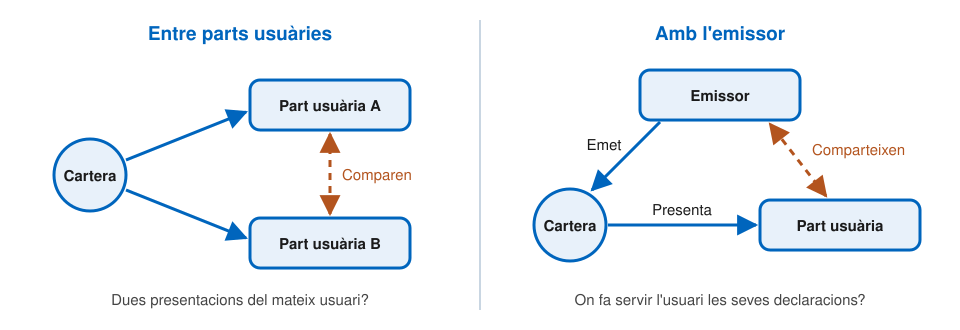

# Privadesa i seguretat

---

## Què exigeix el reglament

- **Control exclusiu** de l'usuari sobre les seves dades
- **Divulgació selectiva** i **pseudònims**
- **Sense seguiment**: ni els emissors ni cap altra part han de poder rastrejar, relacionar o correlacionar les transaccions de l'usuari
- **No vinculabilitat**, quan no cal identificar l'usuari
- El proveïdor de la cartera **no pot recollir** dades d'ús que no siguin necessàries per prestar el servei
- L'usuari té un **registre de transaccions**, i pot demanar la supressió de dades i denunciar peticions sospitoses

---

## Des del disseny

- **Privadesa des del disseny**
  - Minimització: les parts usuàries només recullen els atributs que necessiten i han registrat
  - Divulgació selectiva i control granular de l'usuari
  - Transparència sobre l'ús de les dades
  - Mesures perquè ningú pugui seguir l'usuari
- **Seguretat des del disseny**
  - Identificar i mitigar les vulnerabilitats durant el disseny
  - Reduir la superfície d'atac
  - Compartimentar les dades sensibles i els controls d'accés

---

## Mapa de riscos

El registre de riscos de la cartera identifica catorze riscos d'alt nivell:

- **Identitat**: suplantació, identitat falsa, atributs falsos, robatori d'identitat
- **Dades**: robatori, divulgació, manipulació i pèrdua
- **Transaccions**: no autoritzades, manipulades, repudiades o divulgades
- **Servei**: interrupció
- **Vigilància**

I tres riscos de sistema: **vigilància massiva**, dany reputacional i incompliment legal.

---v

## Amenaces tècniques

- **Atacs físics**: robatori, fuita d'informació, manipulació
- **Errors i males configuracions**
- **Ús de fonts no fiables**
- **Fallades i interrupcions**
- **Accions malicioses**:
  - Intercepció d'informació
  - _Phishing_ i suplantació
  - Repetició de missatges
  - Força bruta
  - Vulnerabilitats de programari i atacs a la cadena de subministrament
  - Programari maliciós

---

## Mesures que ja hem vist

| Risc | Mesura | Tema |
| --- | --- | --- |
| Part usuària falsa | Certificat d'accés | 7 |
| Demanar dades de més | Certificat de registre i aprovació de l'usuari | 7 |
| Declaració falsa | Signatura de l'emissor i llistes de confiança | 7 |
| Declaració copiada | Vinculació al dispositiu | 5 |
| Robatori de claus | Dispositiu criptogràfic segur (WSCD) | 4 |
| Cartera compromesa | Acreditacions i revocació | 4 |
| _Phishing_ entre dispositius | Comprovació de proximitat | 6 |

---

## Vinculabilitat

---v

## D'on ve el problema

- Una declaració conté **valors únics i fixos**: hashes, sals, claus públiques i signatures
- Qui els guarda i els compara pot reconèixer el mateix usuari en presentacions diferents
- Dues variants:
  - **Entre parts usuàries**: dins d'una mateixa part usuària, o entre diverses que col·laboren
  - **Amb l'emissor**: les parts usuàries comparteixen aquests valors amb l'emissor, que sap a qui va emetre cada declaració
- També pot passar després d'una **bretxa de dades**
  - Per això les parts usuàries han de descartar aquests valors quan ja no els necessiten

---

## Mitigar la vinculabilitat entre parts usuàries

| Mètode | Com funciona | Suport a la cartera |
| --- | --- | --- |
| **A. D'un sol ús** | Cada declaració tècnica es presenta una sola vegada | Obligatori |
| **B. De temps limitat** | Declaracions vàlides durant poc temps | Obligatori |
| **C. Lot rotatori** | Es fan servir en ordre aleatori i es torna a començar | Opcional |
| **D. Per part usuària** | Una declaració diferent per a cada part usuària | Opcional |

- Només el mètode A elimina del tot aquesta vinculabilitat
- Mesura organitzativa: a qui faci seguiment se li **revoquen els certificats d'accés**

---

## El límit dels hashes amb sal

- La vinculabilitat **amb l'emissor** no es pot eliminar del tot amb els formats actuals
- L'única mitigació tècnica són les **proves de coneixement zero**
- Però encara no formen part de la cartera:
  - Són complexes d'implementar en maquinari segur
  - Els dispositius criptogràfics actuals no les suporten
  - **No se n'ha triat cap** d'específica
- Mentrestant, la protecció és organitzativa: els emissors estan subjectes a **auditories**

---v

## Proves de coneixement zero

- Una **prova de coneixement zero** permet convèncer algú que una afirmació és certa **sense revelar res més**
- Exemple: demostrar «soc major de 18 anys» sense mostrar la data de naixement ni cap altra dada
- La Comissió les està provant per a la **verificació d'edat**
- L'ARF en recull els requisits i tres especificacions tècniques en elaboració

---

## La crítica dels criptògrafs

- **Juny de 2024**: un grup de criptògrafs convidats per la Comissió publica la seva valoració de l'ARF 1.4
- Diagnòstic:
  - El disseny **no assoleix** els requisits de privadesa que fixa el reglament
  - Es basa en mètodes criptogràfics que no es van dissenyar per a això
  - No n'hi ha prou amb retocs: cal un **redisseny**
- Proposta:
  - Fer servir **credencials anònimes**, en concret la família **BBS**
  - Dissenyar amb **agilitat criptogràfica**, per poder canviar de tecnologia

L'ARF 3.0 reconeix el límit i hi treballa, però encara no l'ha resolt.

---

## Pseudònims

- La cartera ha de poder **generar pseudònims** i guardar-los xifrats al dispositiu
- Les parts usuàries **no els poden rebutjar** si la llei no exigeix identificar l'usuari
- Permeten que una part usuària reconegui el mateix usuari entre sessions, sense saber qui és
- Tres tipus possibles:
  - **Verificable**: l'usuari demostra que el pseudònim és seu, com amb una _passkey_
  - **Acreditat**: un proveïdor de declaracions certifica que el pseudònim pertany a un usuari
  - **Limitat per àmbit**: garanteix un nombre màxim de pseudònims per usuari, per exemple un de sol en una votació

---

## Els certificats web i els navegadors

- eIDAS 2.0 obliga els navegadors a **reconèixer** els certificats qualificats d'autenticació web
- **Novembre de 2023**: una carta oberta d'experts en seguretat alerta sobre l'esborrany
  - Els navegadors haurien de confiar en autoritats designades pels estats
  - No podrien retirar-los la confiança sense permís
  - Això obriria la porta a **interceptar trànsit xifrat**
- El text final permet als navegadors prendre **mesures cautelars** davant d'una bretxa de seguretat, notificant-ho
- El debat sobre si n'hi ha prou continua obert

---

## Qüestions obertes

- **Proves de coneixement zero**: quan arribaran, i amb quina tecnologia?
- **Registre sense autorització**: registrar quins atributs es demanaran és transparència, no un control previ
  - La darrera barrera és l'usuari, que ha d'entendre què aprova
- **Dependència de la plataforma**: la seguretat descansa en el maquinari del dispositiu i en interfícies del navegador i del sistema operatiu que encara s'estan definint

---

## Referències

- Comissió Europea, [_Architecture and Reference Framework_](https://eu-digital-identity-wallet.github.io/eudi-doc-architecture-and-reference-framework/), versió 3.0 (2026), capítols 2, 4 i 7, sota llicència CC BY 4.0
- C. Baum i altres, [_Cryptographers' Feedback on the EU Digital Identity's ARF_](https://github.com/eu-digital-identity-wallet/eudi-doc-architecture-and-reference-framework/issues/200), juny de 2024
- [_Last Chance to fix eIDAS_](https://last-chance-for-eidas.org/), carta oberta, novembre de 2023
- [Reglament (UE) 2024/1183](https://eur-lex.europa.eu/eli/reg/2024/1183/oj), articles 5a, 5b, 45 i 45a
