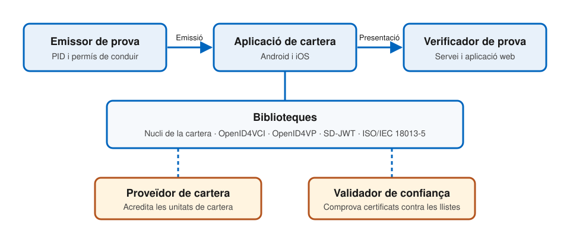

# Implementació

---

## De la norma al codi

- **Reglament i actes d'execució**: el que és obligatori
- **ARF**: com s'ha de construir, de manera orientativa
- **Implementació de referència**: codi que demostra que es pot fer
- **Pilots a gran escala**: proves amb casos d'ús reals
- **Carteres nacionals**: el que arribarà als ciutadans

---

## La implementació de referència

- La desenvolupa la **Comissió Europea**, a partir de l'ARF
- És **codi obert**, sota llicència EUPL 1.2
- Es publica a GitHub, a l'organització `eu-digital-identity-wallet`
- Té una arquitectura **modular**: components reutilitzables en altres projectes
- És un **prototip** i una base per a implementadors, no una cartera per al públic
- Documentació: [docs.eudi.dev](https://docs.eudi.dev)

---v

## Les peces

---v

## Aplicacions i serveis

| Peça | Repositori | Llenguatge |
| --- | --- | --- |
| **Cartera per a Android** | `eudi-app-android-wallet-ui` | Kotlin |
| **Cartera per a iOS** | `eudi-app-ios-wallet-ui` | Swift |
| **Emissor de PID i mDL** | `eudi-srv-pid-issuer` | Kotlin |
| **Verificador** | `eudi-srv-verifier-endpoint` | Kotlin |
| **Verificador web** | `eudi-web-verifier` | TypeScript |
| **Proveïdor de cartera** | `eudi-srv-wallet-provider` | Kotlin |
| **Validador de confiança** | `eudi-srv-trust-validator` | Kotlin |

---v

## Biblioteques

- **Nucli de la cartera**:
  - [`eudi-lib-android-wallet-core`](https://github.com/eu-digital-identity-wallet/eudi-lib-android-wallet-core), per a Android
  - [`eudi-lib-ios-wallet-kit`](https://github.com/eu-digital-identity-wallet/eudi-lib-ios-wallet-kit), per a iOS
- **Emissió**: OpenID4VCI, per a Kotlin i per a Swift
- **Presentació remota**: OpenID4VP, per a Kotlin i per a Swift
- **Formats**: SD-JWT i model de dades d'ISO/IEC 18013-5
- **Presentació presencial**: transferència de dades d'ISO/IEC 18013-5
- **Signatura qualificada remota**: interfícies per a Android i iOS
- **Llistes de confiança**: verificació de cadenes de certificats

---

## Què fa la cartera de referència

- **Obtenir, guardar i presentar** un PID i un permís de conduir mòbil
- **Emissió** amb OpenID4VCI
- **Presentació remota** amb OpenID4VP
- **Presentació presencial** amb ISO/IEC 18013-5
- **Signatura electrònica qualificada** en remot
- **Gestió de la confiança** amb llistes d'entitats de confiança: emissors, verificadors i certificats de registre

Són els mateixos protocols i mecanismes dels temes 5, 6 i 7.

---

## Com començar a provar-la

1. Llegir el **mapa de funcionalitats** a la documentació
2. Clonar l'aplicació d'Android o d'iOS i seguir-ne la **guia d'inici ràpid**
3. Emetre un **PID de prova** amb l'emissor de referència
4. Presentar-lo al **verificador web**
5. Llegir el codi de les biblioteques de cada protocol

És la manera més directa de fixar els temes de credencials i protocols.

---

## Conformitat

- Com se sap que una cartera o un servei compleix les especificacions?
- La Comissió manté un **marc d'avaluació de la conformitat funcional**
  - Documentació a [conformance.eudi.dev](https://conformance.eudi.dev)
- És diferent de la **certificació** de seguretat vista al tema 4:
  - La conformitat funcional comprova que la solució **fa el que ha de fer**
  - La certificació comprova que ho fa de manera **segura**

---

## Pilots a gran escala

- Posen a prova les especificacions de la cartera en **casos d'ús reals**, abans del desplegament
- **Sis** pilots en total: quatre de conclosos i dos d'actius
- Hi participen unes **550** empreses i administracions
  - De 26 estats membres, i també de Noruega, Islàndia i Ucraïna
- Cobreixen més d'**onze** casos d'ús quotidians

---v

## Primera onada (2023)

Quatre consorcis, que van començar l'abril de 2023 i ja han conclòs:

- **POTENTIAL**: serveis governamentals, banca, telecomunicacions, permís de conduir mòbil, signatura electrònica i salut
- **EWC** (_EU Digital Wallet Consortium_): credencials digitals de viatge
- **DC4EU** (_Digital Credentials for Europe_): educació i seguretat social
- **NOBID**: autorització de pagaments, amb països nòrdics i bàltics, Itàlia i Alemanya

---v

## Segona onada (2025)

Dos consorcis nous, actius des de 2025:

- **APTITUDE**: viatges i certificat de matriculació de vehicles, entre d'altres
- **WE BUILD**: casos d'ús d'empresa i de pagaments, entre empreses, amb l'administració i amb consumidors

Casos d'ús en proves: bitllets i registre d'entrada, certificat de matriculació mòbil, credencials digitals de viatge, pagaments i banca, i processos d'empresa.

---

## Un projecte germà: la verificació d'edat

- La Comissió desenvolupa també una **solució europea de verificació d'edat**
  - Vinculada a la protecció dels menors del Reglament de Serveis Digitals
- És una solució de **marca blanca**, perquè els estats l'adaptin i la despleguin
- Comparteix organització a GitHub amb la cartera, amb repositoris propis
- Inclou **proves de coneixement zero**
  - És el banc de proves de la tecnologia que la cartera encara no ha adoptat

---

## I a Espanya?

- L'Administració General de l'Estat té un lloc web per a la cartera: [carteradigital.gob.es](https://carteradigital.gob.es/)
- Aquesta documentació **encara no en descriu** l'estat de desplegament
- On comprovar-lo, per a qualsevol estat membre:
  - El portal de la Comissió sobre la cartera
  - La llista de **carteres certificades**, prevista als actes d'execució
  - El registre públic del **registrador** de cada estat

---

## On som

- **Finals de 2026**: termini perquè cada estat membre ofereixi almenys una cartera
- **Finals de 2027**: termini d'acceptació per al sector privat obligat
- Peces que encara s'estan definint:
  - Les **proves de coneixement zero**
  - L'**esquema europeu de certificació** de carteres
  - L'**API de credencials digitals** dels navegadors
  - La **cartera d'empresa**, per a persones jurídiques

---

## Referències

- Comissió Europea, [organització `eu-digital-identity-wallet` a GitHub](https://github.com/eu-digital-identity-wallet)
- Comissió Europea, [documentació de la implementació de referència](https://docs.eudi.dev)
- Comissió Europea, [_What are the Large Scale Pilot Projects_](https://ec.europa.eu/digital-building-blocks/sites/display/EUDIGITALIDENTITYWALLET/What+are+the+Large+Scale+Pilot+Projects), consultat l'octubre de 2026
- Comissió Europea, [especificació tècnica de la solució de verificació d'edat](https://github.com/eu-digital-identity-wallet/av-doc-technical-specification)
- Comissió Europea, [_Architecture and Reference Framework_](https://eu-digital-identity-wallet.github.io/eudi-doc-architecture-and-reference-framework/), versió 3.0 (2026), sota llicència CC BY 4.0
